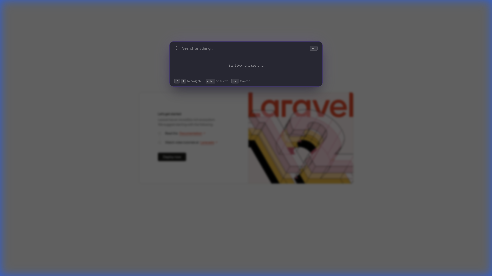

# Laravel OmniSearch

A **global command palette** (`Cmd+K` / `Ctrl+K`) for Laravel 11/12 applications. Search models, navigate routes, and execute commands from anywhere.



## Features

- 🔍 **Global Search** – Search across models, routes, and commands
- ⌨️ **Keyboard-First** – Full keyboard navigation (`↑`, `↓`, `Enter`, `Esc`)
- 🎨 **Premium UI** – Glassmorphism design that looks beautiful out of the box
- 🔌 **Extensible** – Easy to add custom search sources
- ⚡ **Livewire 3** – Real-time search powered by Livewire

## Requirements

- PHP 8.2+
- Laravel 11.x or 12.x
- Livewire 3.x

## Installation

```bash
composer require dvictor357/laravel-omnisearch
```

Publish the config file (optional):

```bash
php artisan vendor:publish --tag=omnisearch-config
```

Add the component to your main layout (before `</body>`):

```blade
<livewire:omnisearch />
```

## Configuration

### Searchable Models

Configure which models should be searchable in `config/omnisearch.php`:

```php
'models' => [
    App\Models\User::class => [
        'columns' => ['name', 'email'],    // Columns to search
        'title' => 'name',                  // Display title
        'description' => 'email',          // Display subtitle
        'route' => 'users.show',           // Named route (receives model ID)
        'icon' => 'user',                  // Icon identifier
        'limit' => 5,                      // Max results for this model
    ],
],
```

### Route Filtering

Control which routes appear in search:

```php
'routes' => [
    'include' => ['*'],
    'exclude' => ['api.*', 'sanctum.*', 'livewire.*'],
],
```

### UI Customization

```php
'ui' => [
    'placeholder' => 'Search anything...',
    'debounce' => 300,
    'max_results' => 10,
    'show_keyboard_hints' => true,
],
```

## Creating Custom Sources

Implement the `SearchSource` interface:

```php
use OmniSearch\Contracts\SearchSource;
use OmniSearch\Data\Result;

class MyCustomSource implements SearchSource
{
    public function getKey(): string
    {
        return 'custom';
    }

    public function getLabel(): string
    {
        return 'My Results';
    }

    public function getIcon(): string
    {
        return 'star';
    }

    public function authorize(): bool
    {
        return auth()->check();
    }

    public function search(string $query): Collection
    {
        return collect([
            Result::navigate(
                id: 'custom:1',
                title: 'Custom Item',
                description: 'A custom search result',
                url: '/custom/1',
                icon: 'star',
                group: $this->getLabel(),
            ),
        ]);
    }
}
```

Register in `config/omnisearch.php`:

```php
'sources' => [
    OmniSearch\Sources\ModelSource::class,
    OmniSearch\Sources\RouteSource::class,
    App\Search\MyCustomSource::class, // Add your source
],
```

## License

MIT
