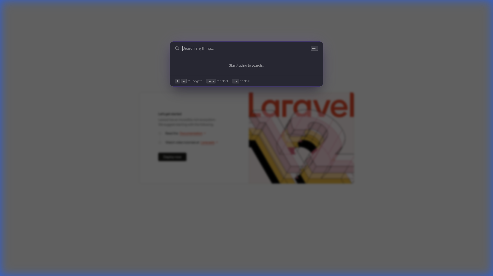

# Laravel OmniSearch

A **global command palette** (`Cmd+K` / `Ctrl+K`) for Laravel 11/12 applications. Search models, navigate routes, execute commands, and more from anywhere in your app.

[](https://packagist.org/packages/dvictor357/laravel-omnisearch)
[](https://packagist.org/packages/dvictor357/laravel-omnisearch)
[](https://packagist.org/packages/dvictor357/laravel-omnisearch)



## Features

### Core Features
- 🔍 **Global Search** – Search across models, routes, and custom sources
- ⌨️ **Keyboard-First** – Full keyboard navigation (`↑`, `↓`, `Enter`, `Esc`, `Tab`)
- 🎨 **Premium UI** – Glassmorphism design with smooth animations
- 🔌 **Extensible** – Easy to add custom search sources
- ⚡ **Livewire 3** – Real-time search powered by Livewire
- 📊 **Relevance Scoring** – Results ranked by relevance, not just source order

### UX Enhancements
- 📝 **Recent Searches** – Stores and displays your search history
- 📋 **Copy to Clipboard** – Dedicated copy action type with toast notifications
- 🎯 **Multiple Action Types** – Navigate, copy, or open modals
- 🖼️ **Dynamic Icons** – Built-in icon system with 15+ icons
- 🎭 **Theming** – CSS variables for easy customization
- ♿ **Accessible** – Full ARIA support and screen reader compatible

### Developer Experience
- 🔧 **Artisan Commands** – `omnisearch:install`, `omnisearch:make-source`
- 📡 **Events** – Hook into search lifecycle with events
- 🌍 **i18n Ready** – Translations support out of the box
- 🧪 **Well Tested** – Comprehensive test coverage

## Requirements

- PHP 8.2+
- Laravel 11.x or 12.x
- Livewire 3.x

## Installation

```bash
composer require dvictor357/laravel-omnisearch
```

### Quick Setup

Run the installer command:

```bash
php artisan omnisearch:install
```

Or publish assets manually:

```bash
php artisan vendor:publish --tag=omnisearch-config
php artisan vendor:publish --tag=omnisearch-views
```

Add the component to your main layout (before `</body>`):

```blade
<livewire:omnisearch />
```

## Configuration

### Keyboard Shortcuts

```php
'shortcuts' => ['k', '/'],      // Multiple shortcuts supported
'modifier' => 'cmd',             // 'cmd', 'ctrl', or 'alt'
```

### Searchable Models

Configure which models should be searchable in `config/omnisearch.php`:

```php
'models' => [
    App\Models\User::class => [
        'columns' => ['name', 'email'],    // Columns to search
        'title' => 'name',                 // Display title
        'description' => 'email',          // Display subtitle
        'route' => 'users.show',           // Named route (receives model ID)
        'icon' => 'user',                   // Icon identifier
        'limit' => 5,                      // Max results for this model
        'group' => 'Users',                // Custom group label (optional)
    ],
],
```

### Route Filtering

Control which routes appear in search:

```php
'routes' => [
    'include' => ['*'],
    'exclude' => ['api.*', 'sanctum.*', 'livewire.*'],
],
```

### UI Customization

```php
'ui' => [
    'placeholder' => 'Search anything...',
    'debounce' => 300,
    'max_results' => 10,
    'show_keyboard_hints' => true,
    'max_recent_searches' => 10,
    'enable_history' => true,
    'theme' => [
        'primary' => '#8b5cf6',
        'bg' => 'rgba(30, 30, 46, 0.85)',
        'radius' => '16px',
        'accent' => 'rgba(139, 92, 246, 0.3)',
    ],
],
```

### Search Settings

```php
'search' => [
    'use_scoring' => true,          // Enable relevance scoring
    'min_score' => 0,
    'highlight_matches' => true,
],
```

## Creating Custom Sources

### Basic Source

Implement the `SearchSource` interface:

```php
use OmniSearch\Contracts\SearchSource;
use OmniSearch\Data\Result;
use Illuminate\Support\Collection;

class MyCustomSource implements SearchSource
{
    public function getKey(): string
    {
        return 'custom';
    }

    public function getLabel(): string
    {
        return 'My Results';
    }

    public function getIcon(): string
    {
        return 'star';
    }

    public function authorize(): bool
    {
        return auth()->check();
    }

    public function getSynonyms(): array
    {
        return ['my-result', 'custom-result'];
    }

    public function getDependencies(): array
    {
        return [];
    }

    public function search(string $query): Collection
    {
        return collect([
            Result::navigate(
                id: 'custom:1',
                title: 'Custom Item',
                description: 'A custom search result',
                url: '/custom/1',
                icon: 'star',
                group: $this->getLabel(),
            ),
        ]);
    }
}
```

### Command Source with Dependencies

Use the `CommandSource` base class for commands with dependencies:

```php
use OmniSearch\Sources\CommandSource;
use OmniSearch\Data\Result;
use Illuminate\Support\Collection;

class CreateUserCommand extends CommandSource
{
    public function getKey(): string
    {
        return 'create-user';
    }

    public function getLabel(): string
    {
        return 'Create User';
    }

    public function getIcon(): string
    {
        return 'user-plus';
    }

    public function getDependencies(): array
    {
        return [
            'team' => App\Search\TeamSearchDependency::class,
        ];
    }

    public function search(string $query): Collection
    {
        return collect([
            Result::modal(
                id: 'command:create-user',
                title: 'Create New User',
                description: 'Open user creation form',
                modalName: 'create-user-modal',
                icon: 'user-plus',
                group: 'Commands',
            ),
        ]);
    }

    public function execute(...$args): mixed
    {
        // Command execution logic
    }
}
```

### Copy Action Result

Create results that copy text to clipboard:

```php
Result::copy(
    id: 'copy:email',
    title: 'Copy Email',
    description: 'Click to copy user email',
    textToCopy: $user->email,
    icon: 'copy',
    group: 'Actions',
);
```

Register in `config/omnisearch.php`:

```php
'sources' => [
    OmniSearch\Sources\ModelSource::class,
    OmniSearch\Sources\RouteSource::class,
    App\Search\MyCustomSource::class, // Add your source
],
```

## Events

OmniSearch fires events you can listen to:

```php
use OmniSearch\Events\SearchPerformed;
use OmniSearch\Events\ResultSelected;
use OmniSearch\Events\ModalOpened;

// Listen for search events
Event::listen(SearchPerformed::class, function ($event) {
    // $event->query, $event->resultsCount, $event->duration
});

// Listen for result selection
Event::listen(ResultSelected::class, function ($event) {
    // $event->id, $event->title, $event->actionType, $event->url
});

// Listen for modal open
Event::listen(ModalOpened::class, function ($event) {
    // $event->trigger
});
```

## Artisan Commands

```bash
# Install OmniSearch assets
php artisan omnisearch:install

# Create a new search source
php artisan omnisearch:make-source MyCustom

# Clear search cache
php artisan omnisearch:clear-cache
```

## Available Icons

| Icon | Name | Description |
|------|------|-------------|
| 🔍 | `search` | Search icon |
| 👤 | `user` | User/profile |
| 🔗 | `link` | Links/routes |
| 📋 | `copy` | Copy action |
| ✅ | `check` | Success/check |
| 📄 | `file` | File/document |
| 🗃️ | `database` | Database/models |
| ⚙️ | `settings` | Settings |
| ✨ | `sparkles` | AI/featured |
| 📐 | `expand` | Modal/action |
| 🕐 | `clock` | History/time |

## Contributing

Contributions are welcome! Please see [CONTRIBUTING.md](CONTRIBUTING.md) for details.

## Security Vulnerabilities

Please review [our security policy](https://github.com/dvictor357/laravel-omnisearch/security/policy) on how to report security vulnerabilities.

## License

Laravel OmniSearch is open-sourced software licensed under the [MIT license](LICENSE.md).
